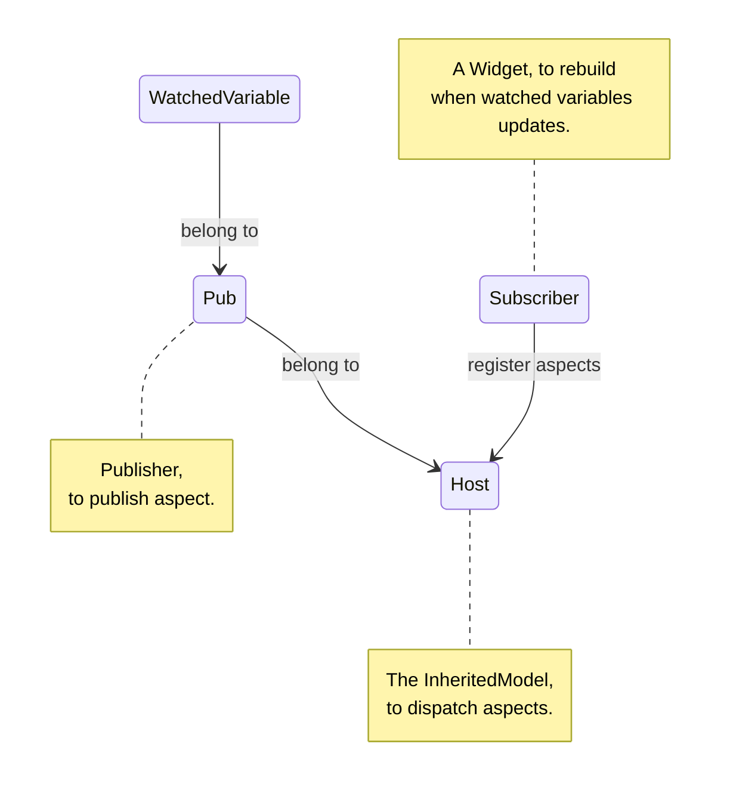
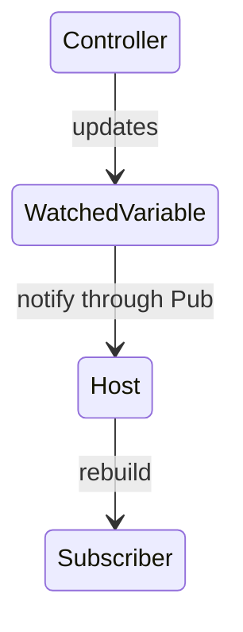
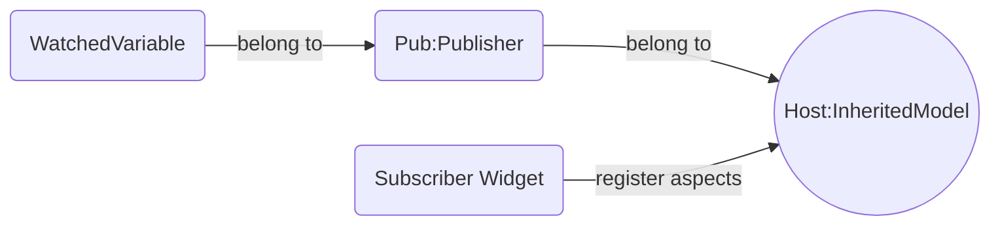
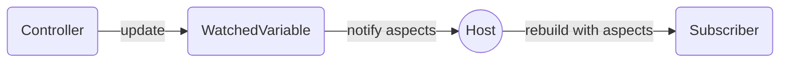

Initialize registration:

```mermaid
stateDiagram-v2
    WatchedVariable --> Pub : belong to
    note right of Pub
    Publisher,
    to publish aspect.
    end note
    Pub --> Host : belong to
    Subscriber --> Host : register aspects
    note left of Subscriber
    A Widget, to rebuild
    when watched variables updates.
    end note
    note right of Host
    The InheritedModel,
     to dispatch aspects.
    end note
```

When updating:

```mermaid
stateDiagram-v2
    WatchedVariable --> Host : notify through Pub
    Host --> Subscriber : rebuild
    Controller --> WatchedVariable : updates
```

Initialize registration:

```mermaid
graph LR
    W(WatchedVariable) -- belong to --> P(Pub:Publisher)
    P -- belong to --> H((Host:InheritedModel))
    S(Subscriber Widget) -- register aspects --> H
```

When updating:

```mermaid
graph LR
    W(WatchedVariable) --notify aspects --> H
    H((Host)) -- rebuild with aspects--> S(Subscriber)
    C(Controller) -- update --> W
```
